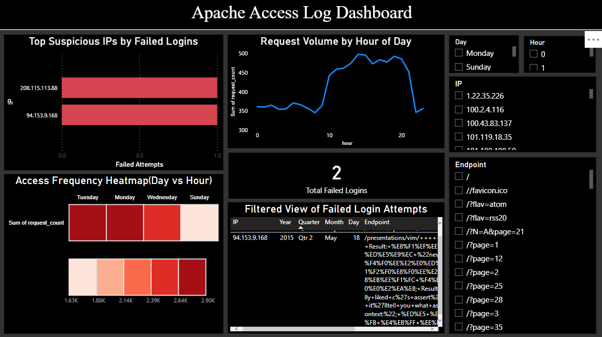

# 🔐Apache Access log - Cybersecurity ETL & Dashboard

This project analyzes Apache server access logs to detect suspicious IP activity, failed logins, and traffic patterns using:
- **Python (Jupyter)** for log parsing and ETL
- **Power BI** for interactive visual dashboards

---

## 📂 Project Structure

- `apache_logs/` - Raw Apache log file
- `notebooks/` - Jupyter notebook for ETL
-  `outputs/` - Cleaned and aggregated data
-  `dashboard/` - `.pbix` Power BI file
-  'screenshots/` - Dashboard previews

---

## 📊 Dashboard Insights

### Key Visuals:
- Top suspicious IPs by failed login attempts
- Request volume by hour
- Heatmap of access activity by day/hour
- Filterable table for failed login details

---

## ⚙️Technologies Used

- Python (pandas, regex)
- Power BI
- Regex parsing for Apache logs

---

## 📌 Learnings

- Built ETL pipeline from raw log files
- Identified security threats usign log data
- built business-ready dashboard for SOC teams

